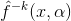
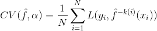
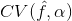
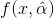

# Table of Contents
* [Concepts](#concepts)
  * [What is Machine Learning for?](#what-is-machine-learning-for)
  * [What is Machine Learning?](#what-is-machine-learning)
  * **[How to Setup a Business Problem as a Machine Learning Problem?](#how-to-setup-a-business-problem-as-a-machine-learning-problem)**
  * [Featurization or Feature Extraction](#featurization-or-feature-extraction)
  * [Loss Function](#loss-function)
  * [Main Principle of Train/Test Split](#main-principle-of-traintest-split)
  * [What Might go Wrong with ML?](#what-might-go-wrong-with-ml)
  * [Model Complexity and Overfitting](#model-complexity-and-overfitting)  
* [Cross-Validation](#cross-validation)
  * [What's the Purpose of Cross-Validation?](#whats-the-purpose-of-cross-validation)
  * [Types of Cross-Validation](#types-of-cross-validation)
  * [How to Choose K?](#how-to-choose-k)
  * [The Right Way to Do Cross-Validation](#the-right-way-to-do-cross-validation)
* 
* 

# Philosophy
* It's important to understand the ideas behind the various techniques, in order to know how and when to use them.
* One has to understand the simpler methods first, in order to grasp more sophistated methods
* It is important to accurately assess the performance of a method, to know how well or how bad it is working (simpler methods often perform as well as fancier ones!) [Stanford Statistical Learning Course](https://lagunita.stanford.edu/courses/HumanitiesSciences/StatLearning/Winter2016)
* 

# Concepts

## What is Machine Learning for?

* Solve a prediction problem: given an input `x`, predict an "appropriate" output `y`
  * Predict qualitive outputs
    * Multiclass
    * Binary Classification
  * Predict quantitative outputs
    * Regression
  * Both can also be viewed as a task in function approximation

* Describe how the given data are organized or clustered.
  * Clustering
  
### Types of Learning
* Supervised vs. Unsupervised
  * An intermediate learning setting in which, while the training examples contain more information than the test examples, the learner is required to predict even more information for the test examples. For example, reinforcement learning.

* Active vs. Passive Learners
* Helpfulness of the Teacher
  * Passive teacher doesn't actively feed the most useful information to learner
    * We postulate that the training data (or the learner's experience) is generated by some random process (from the teacher, the environment). This is the building block in the branch of "statistical learning".
  * Adversarial Teacher: e.g. spammer makes an effort to mislead the spam filtering designer
* Online vs. Batch Learning Protocol

### Machine Learning Algorithms
#### Linear Regression
* Subset Selection
* Lasso
* Linear Models with Least Squares (more flexible with all variables, i.e. no sparsity)
* Generalized Additive Models

#### Others
* Trees
* Bagging
* Boosting
* SVM

#### Smoothers
* Nearest Neighbor Methods
* Kernel Smoother
* Spline Smoother
  * Thin-plate spline
  
### Trade-Offs
#### Prediction Accuracy vs. Interpretability
* Linear models are easy to interpret but have less accuracy.

#### Good-fit vs. Over-fit vs. Under-fit

* Choosing the amount of flexibility of a model amounts to a bias-variance trade-off. And depending on the problem, we might want to make the trade-off in a different place. And we can use the validation set or left out data to help us make that choice.
* More complicated models typically have lower bias at the cost of higher variance. This has an unclear effect on Reducible Error (could go up or down) and no effect on Irreducible Error.

#### Parsimony vs. Black-box
* We often prefer a simpler model involving few variables over a black-box predictor involving them all.

### Relations to other fields
* Machine learning can be viewed as a branch of AI.
  * But ML is not trying to build automated imitation of intelligent behavior, but rather to complement human intelligence.
* ML vs. Statistics
  * Statisticans do hypothesis testing (on an assumption) while ML aims to use the data to come up with a description of the causes. 
  * Algorithmic considerations play a major role in ML. 
  * Statistics is often interested in asymptotic behavior, the theory of ML focuses on finite sample bounds. Namely, given the size of available samples, ML theory aims to figure out the degree of accuracy that a learer can expect on the basis of such samples.
  * In ML the emphasis is on the working under a "distribution-free" setting (the learner assumes as little as possible about the nature of the data distribution and allows the learning algorithm to figure out which models best approximate the data-generating process), while in statistics it is common to work under the assumption of certain presubscribed data models. 
  
  

## When do we need machine learning?
* Two aspects of a given problem may call for the use of programs that learn and improve on the basis of their "experience" (instead of writing programs directly to solve)
  * Tasks that are too Complex to program
    * Tasks performed by animals/humans: driving, speech recognition, image understanding
    * Tasks beyond human capabilities: astronomical data, weather prediction
  * Need for adaptivity

## What is Machine Learning?

> Prediction function: It takes input `x` and produce an output `y`.

> A machine learning algorithm takes "training data" as input, "learns" from the training data, and generates an ouptut, which is a "predcition function". Machine learning helps to find the **best prediction funciton**. 

* Machine learning is basically programming with data. [Alex Smola, CMU 10701-15]
* Roughly speaking learning is the process of converting experience (training data) into expertise of knowledge (prediction function).

### Inductive Reasoning/Inductive Inference
Definition: A successful learner should be able to progress from individual examples to broader *generalization*.

* Compare this with a rudimentary "learning by memorization" approach, which can't generalize.

### What distinguishes learning mechanisms that result in superstition from useful learning?
* One distinguishing feature between the bait shyness learning and the pigeon superstition is the incorporation of *prior knowledge* that biases the learning mechanics m. This is referred to as *inductive bias*.
* It turns out that the incorporation of prior knowledge, biasing the learning process, is inevitable for the success of learning algorithms ("No-Free-Lunch Theorem")

* The development of tools for expressing domain expertise, translating it into a learning bias, and quantifying the effect of such a bias on the success of learning is a central theme of the theory of machine learning.
  * The stronger the prior knowledge, the easier it is to learn from further examples
  * The stronger the prior knowledge, the less flexible the learning is. 

## How to Setup a Business Problem as a Machine Learning Problem?
* What is the business manager really looking for?
* What type of an ML problem is this?
* What are the inputs and labels?
* How would the business manager evaluate success/performance?
* How would we evaluate the performance of an ML algorithm during development?
* How often should we retrain our model?
* Existing resources/libraries/services that we can leverage?
* Next steps?

## Featurization or Feature Extraction
> Mapping raw input `x` to Rd.

## Loss Function
> A loss function scores how far off a prediction is from the desired "target" output.

### Classification Loss or `0/1` Loss
* Loss is 1 if prediction is wrong, else 0.

### Square Loss for Regression

## Main Principle of Train/Test Split
* Train/Test setup should represent Train/Deploy scenario as closely as possible
  * Random split of labeled data into train/test is usually the right approach
  * Time seriese data: split data in time, rather than randomly

## What Might go Wrong with ML? 
### Nonstationarity
> Nonstationarity: when the thing you are modeling changes over time.
* Nonstationarity Takes Two Forms:
  * **Covariate Shift**: input distribution changed bewteen training and deployment. (Covariate is another term for input feature)
    * e.g. once popular search queries become less popular
  * **Concept Drift**: correct output for given input changes over time.
    * e.g. season changes and given person no longer is interested in winter coats.

### Leakage
> Information about labels sneak into the features.

### Sample Bias
> Test inputs and deployment inputs have different distributions.

## Model Complexity and Overfitting
> Hyperparameter: It is a parameter of the Machine Learning algorithm (which finds the best parameters for a model) itself.
> Overfitting: training performance is good but test/validation performance is poor.

* Fix overfitting
  * Reduce model complexity
  * Get more training data

# Cross-Validation

## What's the Purpose of Cross-Validation?
* (ESL) Cross-Validation is used for estimating *prediction error*.
  * It directly estimates the *expected extra-sample error*: , the *average generalization error* when the method, , is applied to an independent test sample from the join distribution of `X` and `Y`.
  * We might hope that cross-validation estimates the *conditional error*, with the training set  held fixed. But cross-validation typically estimates well only the *expected prediction error* (or *average error* Err.

* Cross-Validation can also be used to find the optimal hyperparameter.
  * Given a set of models `f(x,α)` indexed by a tuning parameter `α`, denote by  the `αth` model fit with the `kth` part of the data removed. Then for this set of models we define
  
  
  
  * The function  provides an estimate of the test error curve, and we find the hyperparameter that minimizes it.
    * Often a "one-standard error" rule is used with cross-validation, in which we choose the most parsimonious model whose error is no more than one standard error above the error of the best model.
  * Our final chosen model is , which we then fit to all the data.

## Types of Cross-Validation
* K-Fold Cross-Validation  
* Leave-One-Out Cross-Validation
  * Special case of K-Fold cross-validation when `K=N`.

## How to Choose K?
* With `K=N`, the cross-validation estimator is approximately unbiased for the trun (expected) prediction error, but have high variance because the N "training sets" are so similar to one another.
  * Leave-one-out cross-validation has low bias but can have high variance. 
* With K smaller, cross-validation estimator has lower variance, but bias could be a problem, depending on how the performance of the learning method varies with the size of the training set. 
* It is thus important to report the estimated standard error of the CV estimate. 

## The Right Way to Do Cross-validation
* In general, with a multistep modeling procedure, cross-validation must be applied to the entire sequence of modeling steps. In particular, samples must be "left out" before any selection or filtering steps are applied. There is one qualification: initial *unsupervised* screening steps (no class labels are involved) can be done before samples are left out. 
  * Leaving samples out (in cross-validation) **after** the variables (features) have been selected (based on all of the samples) does not correctly mimic the application of the classifier to a completely independent test set, since these predictors "have already seen" the left out samples. 

## Other Related
* Forward Chaining is the cross validation for Time Series
* Finite Class Lemma???
  * As you test more and more on a data set, you are more likely to overfit.
  * The size of confidence interval grows with the number of things you are testing proportionately.  

## TODO
* Think about both amount of data and computation needed to learn.
* SVM “is just” ERM with hinge loss with `2 regularization
* Pegasos “is just” SVM with SGD with a particular step size rule
* Random forest “is just” bagging with trees, with an interesting tweak on choosing splitting variables
* Matrix Calclus
* Hyperplane and subspace
* Affine set
* nonsingular
* Confidence interval (ISL)
* Hypothesis test: explanation of p-value, Hypothesis Testing and Confidence Intervals

* Print out concept checks and problems

