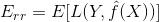
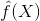
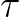

# Table of Contents
* [Concepts](#concepts)
  * [What is Machine Learning for?](#what-is-machine-learning-for)
  * [What is Machine Learning?](#what-is-machine-learning)
  * **[How to Setup a Business Problem as a Machine Learning Problem?](#how-to-setup-a-business-problem-as-a-machine-learning-problem)**
  * [Featurization or Feature Extraction](#featurization-or-feature-extraction)
  * [Loss Function](#loss-function)
  * [Main Principle of Train/Test Split](#main-principle-of-traintest-split)
  * [Cross-Validation](#cross-validation)
  * [What Might go Wrong?](#what-might-go-wrong)
  * [Model Complexity and Overfitting](#model-complexity-and-overfitting)
* 
* 

# Concepts
## What is Machine Learning for?
* Solve a prediction problem: 
  * given an input `x`
  * predict an "appropriate" output `y`

* Most Common ML problem types
  * Binary Classification
  * Multiclass
  * Regression

## What is Machine Learning?
> Prediction function: It takes input `x` and produce an output `y`.
* Machine learning helps to find the **best prediction funciton**.
  * Machine Learning is not a rule based system.
  
* A machine learning algorithm takes "training data" as input, "learns" from the training data, and generates an ouptut, which is a "predcition function" that produces output `y` given input `x`.

## How to Setup a Business Problem as a Machine Learning Problem?
* What is the business manager really looking for?
* What type of an ML problem is this?
* What are the inputs and labels?
* How would the business manager evaluate success/performance?
* How would we evaluate the performance of an ML algorithm during development?
* Can you build a model for one use using another user’s data? Possibly no!
* How often should we retrain our model?
* Existing resources/libraries/services that we can leverage?
* Next steps?

## Featurization or Feature Extraction
> Mapping raw input `x` to Rd.

## Loss Function
> A loss function scores how far off a prediction is from the desired "target" output.

### Classification Loss or `0/1` Loss
* Loss is 1 if prediction is wrong, else 0.

### Square Loss for Regression

## Main Principle of Train/Test Split
* Train/Test setup should represent Train/Deploy scenario as closely as possible
  * Random split of labeled data into train/test is usually the right approach
  * Time seriese data: split data in time, rather than randomly

## Cross-Validation
* What's the purpose of cross validation?
  * (ESL) Cross Validation is used for estimating prediction error.
  * It directly estimates the *expected extra-sample error*: , the average generalization error when the method,  ,is applied to an independent test sample from the join distribution of `X` and `Y`. 
  * We might hope that cross-validation estimates the *conditional error*, with the training set  held fixed. But cross-validation typically estimates well only the expected prediction error (or average error Err.
* Forward Chaining is the cross validation for Time Series
* Finite Class Lemma???
  * As you test more and more on a data set, you are more likely to overfit.
  * The size of confidence interval grows with the number of things you are testing proportionately.
  
### K-Fold Cross-Validation  

### Leave-One-Out Cross-Validation
* Special case of K-Fold cross-validation when `K=N`.

## What Might go Wrong? 
### Nonstationarity
> Nonstationarity: when the thing you are modeling changes over time.
* Nonstationarity Takes Two Forms:
  * **Covariate Shift**: input distribution changed bewteen training and deployment. (Covariate is another term for input feature)
    * e.g. once popular search queries become less popular
  * **Concept Drift**: correct output for given input changes over time.
    * e.g. season changes and given person no longer is interested in winter coats.

### Leakage
> Information about labels sneak into the features.

### Sample Bias
> Test inputs and deployment inputs have different distributions.

## Model Complexity and Overfitting
> Hyperparameter: It is a parameter of the Machine Learning algorithm (which finds the best parameters for a model) itself.
> Overfitting: training performance is good but test/validation performance is poor.

* Fix overfitting
  * Reduce model complexity
  * Get more training data

  

